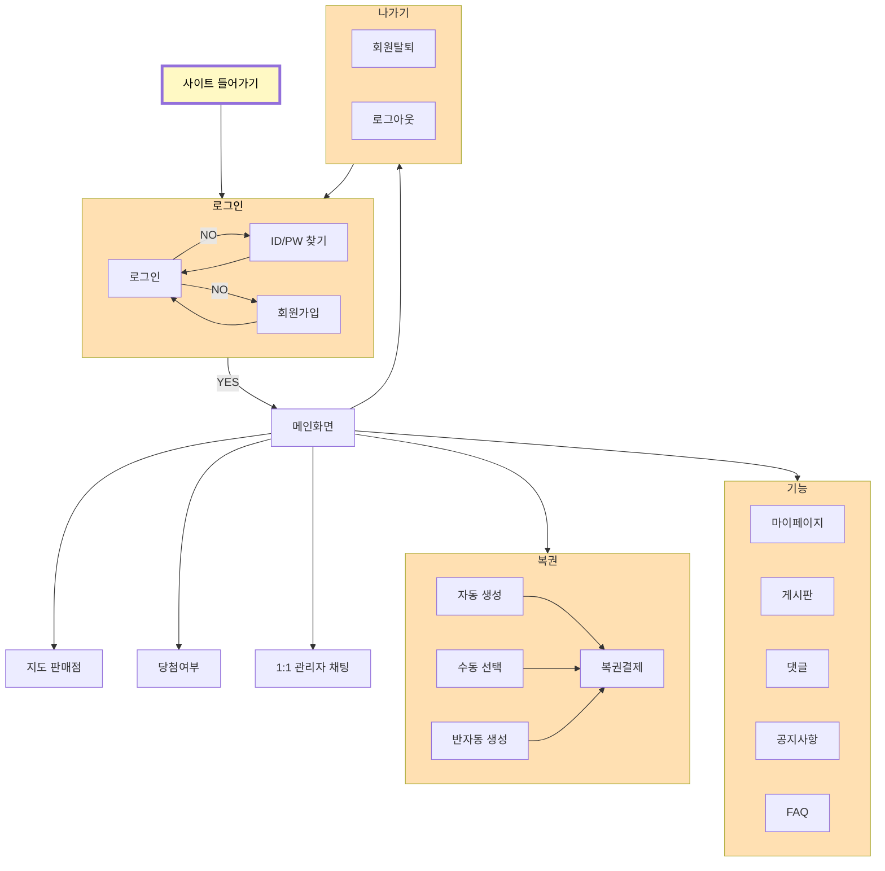

[사이트](https://mermaid.js.org/)

```mermaid
flowchart TD
 subgraph 로그인["로그인"]
        A["로그인"]
        C["ID/PW 찾기"]
        D["회원가입"]
  end
 subgraph 복권["복권"]
        E["복권결제"]
        H["자동 생성"]
        I["수동 선택"]
        J["반자동 생성"]
        H & I & J --> E
  end
 subgraph 기능
        MP["마이페이지"]
        K["게시판"]
        L["댓글"]
        M["공지사항"]
        N["FAQ"]
  end
 subgraph 나가기["나가기"]
        P["회원탈퇴"]
        Q["로그아웃"]
  end
    Z["사이트 들어가기"] --> 로그인
    로그인 -- YES --> B["메인화면"]
    A -- NO --> C & D
    C --> A
    D --> A
    B --> 복권 & F["지도 판매점"] & G["당첨여부"] & 기능 & O["1:1 관리자 채팅"] & 나가기
    나가기 --> 로그인
    

    style Z stroke-width:4px,stroke-dasharray: 0,color:#000000,fill:#FFF9C4
    style 로그인 fill:#FFE0B2,color:#000000
    style 복권 fill:#FFE0B2
    style 기능 fill:#FFE0B2
    style 나가기 fill:#FFE0B2


```