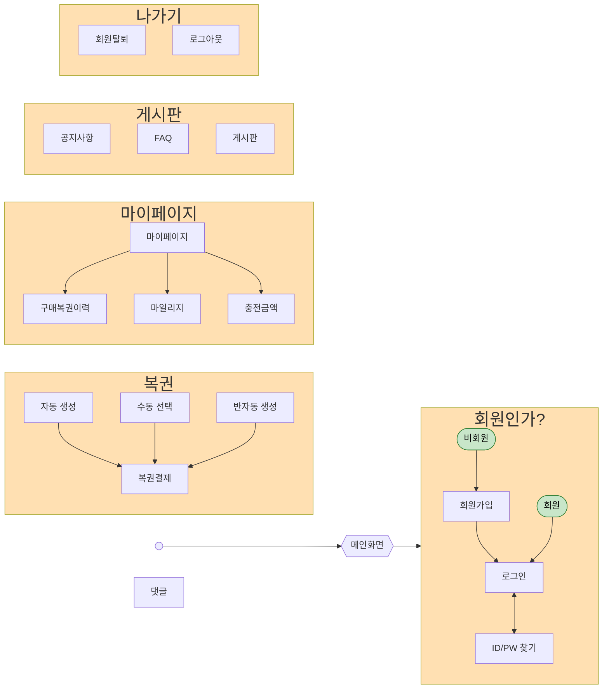

[사이트](https://mermaid.js.org/)

# 다이어로그


# 로그인


# database
```mermaid
direction TB
	회원가입{
		string ID  "pk" 
		String pw  "not null"  
		String nickname  "not null"  
		string name  "not null"  
		string email  "not null"  
	}
	회원 {
		string ID  "pk" 
    	String pw  "not null"  
		String nickname  "not null"  
		string name  "not null"  
		string email  "not null"  
        int pay "defualt : 0"
        int ticket "defualt : 0"
        boolean admin "defualt : false"
	}
    복권{
        String ID "pk"
        String ticket "not null"
        INT round "fk(당첨)"
    }
    당첨{
        INT round "PK, fk"
        int num1 
        int num2
        int num3 
        int num4 
        int num5 
        int bonus 
    }
    게시판{
        String ID "pk"
        String nickname ""
    }

	회원가입||--||회원:"가입"
    회원||--o{복권:"구매"
    당첨||--o{복권:"확인"
    회원||--o{게시판:"창작"
```